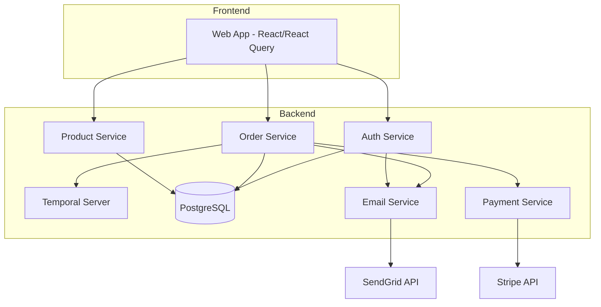
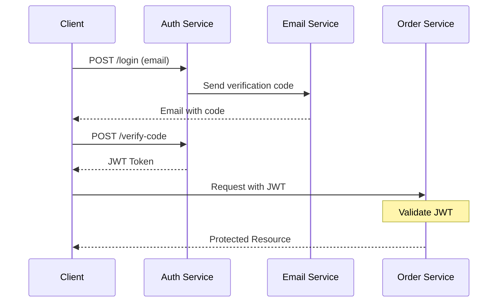
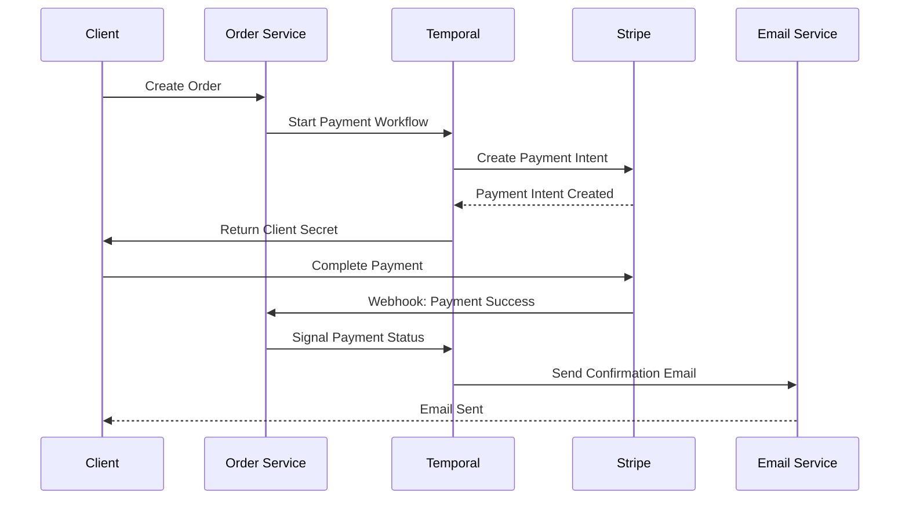
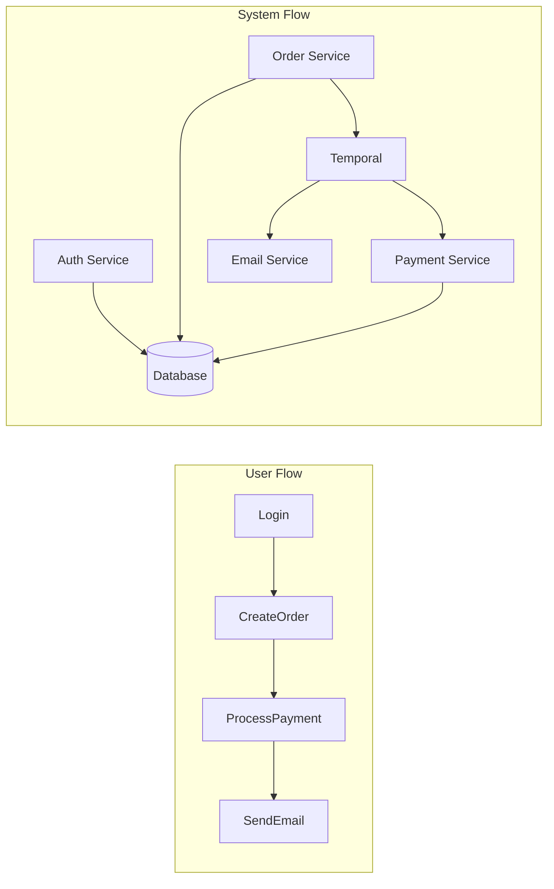
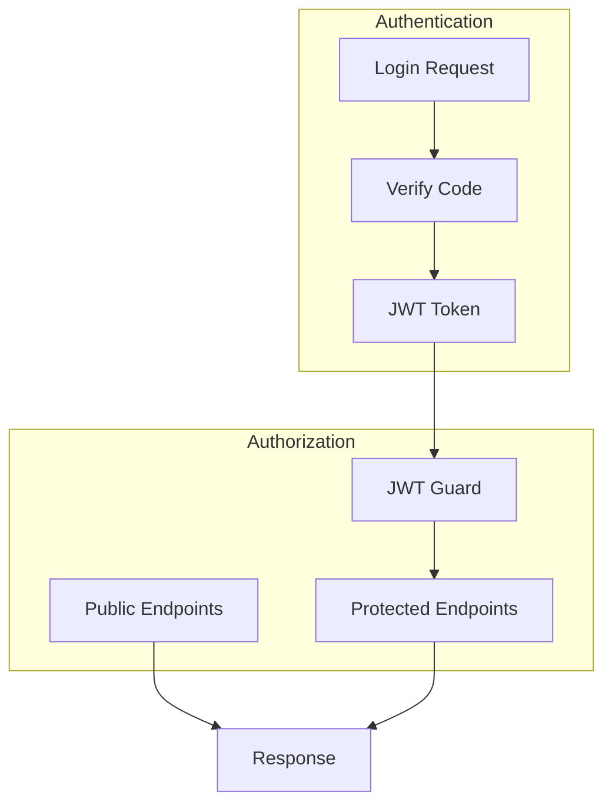

# Project Architecture Overview

This document provides a high-level overview of the ProjectX architecture, a full-stack event-driven application using Temporal workflows and React.

## System Architecture

## Authentication Flow

## Event Flow - Payment Processing

## Service Architecture

### Auth Service (Port 8081)
- JWT-based authentication
- User management
- Session handling
- Public endpoints:
  - `/login`: Email-based login
  - `/verify-code`: Verify login code
  - `/health`: Service health check

### Order Service (Port 8082)
- Order management
- Payment processing
- Webhook handling
- Temporal workflow orchestration
- Public endpoints:
  - `/health`: Service health check
- Protected endpoints (require JWT):
  - `/order`: Create and manage orders
  - `/order/:referenceId`: Get order status

### Product Service (Port 8083)
- Product catalog management
- Inventory tracking
- Product search and filtering
- Public endpoints:
  - `/health`: Service health check
- Protected endpoints (require JWT):
  - `/products`: List and manage products
  - `/products/:id`: Get product details

### Shared Libraries
- `@projectx/core`: Core utilities and configurations
  - Authentication middleware
  - Health checks
  - Common security setup
- `@projectx/db`: Database access and models
- `@projectx/email`: Email service integration
- `@projectx/payment`: Payment provider integration
- `@projectx/workflows`: Temporal workflow definitions

## Data Flow

## Security Architecture

## Technology Stack
- **Frontend**: React, React Query, TailwindCSS
- **Backend**: NestJS, TypeScript
- **Database**: PostgreSQL
- **Workflow Engine**: Temporal
- **Payment Processing**: Stripe
- **Email Service**: SendGrid
- **Development Tools**: Docker, Nx Monorepo

## Environment Configuration
Each service requires specific environment variables:

### Auth Service
- `AUTH_PORT`: Service port (default: 8081)
- `JWT_SECRET`: Secret for JWT signing
- `SENDGRID_API_KEY`: For email notifications

### Order Service
- `ORDER_PORT`: Service port (default: 8082)
- `JWT_SECRET`: Same secret as Auth service
- `STRIPE_SECRET_KEY`: Stripe API key
- `STRIPE_WEBHOOK_SECRET`: Stripe webhook signing secret
- `SENDGRID_API_KEY`: For email notifications

### Product Service
- `PRODUCT_PORT`: Service port (default: 8083)
- `JWT_SECRET`: Same secret as Auth service

## Health Monitoring
Both services implement health checks that monitor:
- Database connectivity
- Memory usage (heap and RSS)
- External service dependencies 