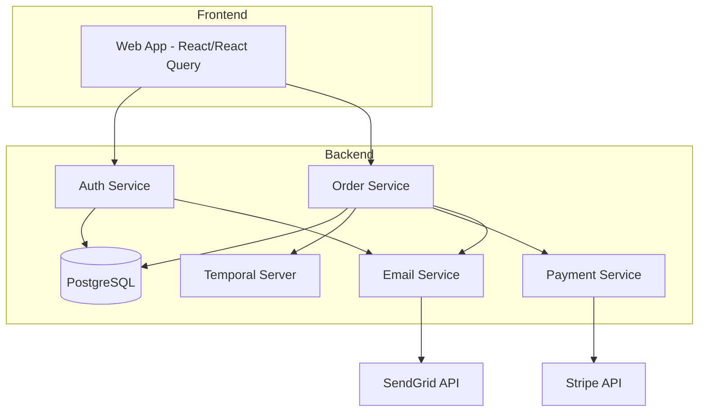
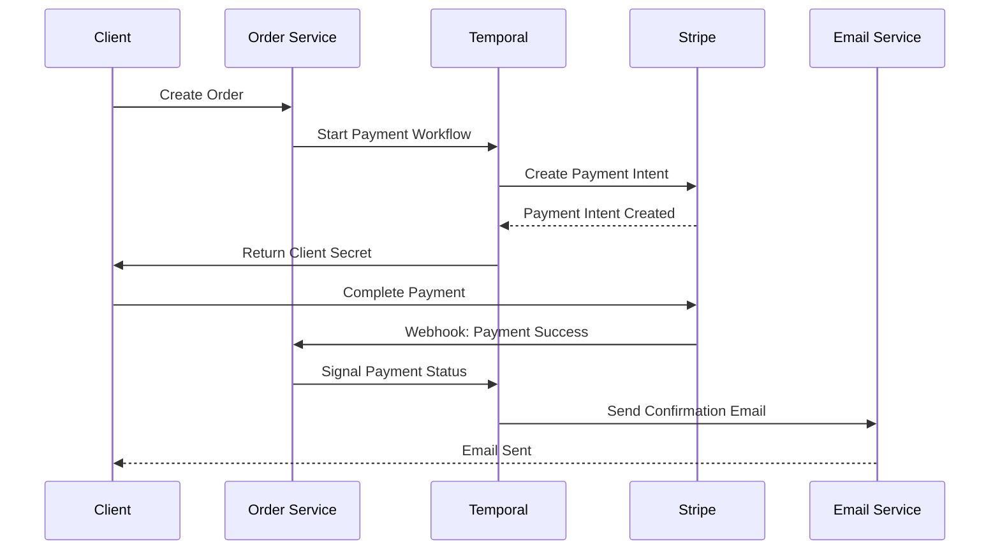
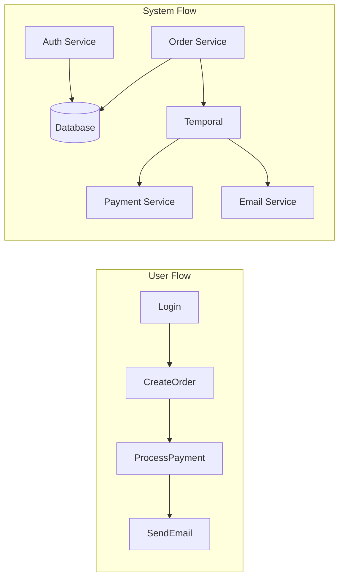

# Project Architecture Overview

This document provides a high-level overview of the ProjectX architecture, a full-stack event-driven application using Temporal workflows and React.

## System Architecture

## Event Flow - Payment Processing

## Service Architecture

### Auth Service (Port 8081)
- JWT-based authentication
- User management
- Session handling

### Order Service (Port 8082)
- Order management
- Payment processing
- Webhook handling
- Temporal workflow orchestration

### Shared Libraries
- `@projectx/core`: Core utilities and configurations
- `@projectx/db`: Database access and models
- `@projectx/email`: Email service integration
- `@projectx/payment`: Payment provider integration
- `@projectx/workflows`: Temporal workflow definitions

## Data Flow

## Technology Stack
- **Frontend**: React, React Query, TailwindCSS
- **Backend**: NestJS, TypeScript
- **Database**: PostgreSQL
- **Workflow Engine**: Temporal
- **Payment Processing**: Stripe
- **Email Service**: SendGrid
- **Development Tools**: Docker, Nx Monorepo 