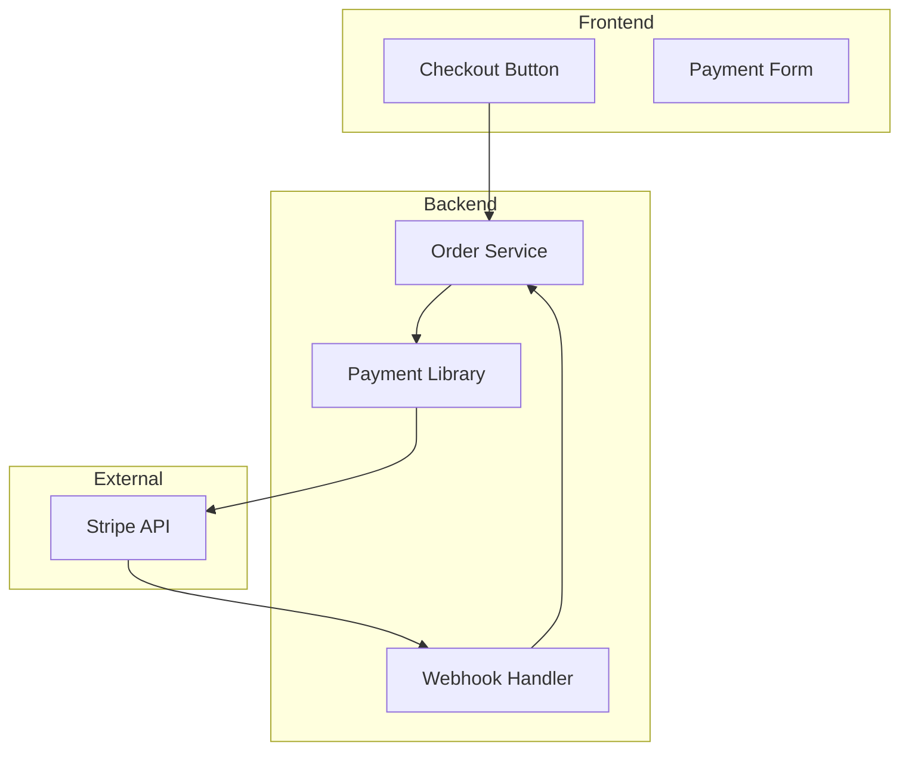
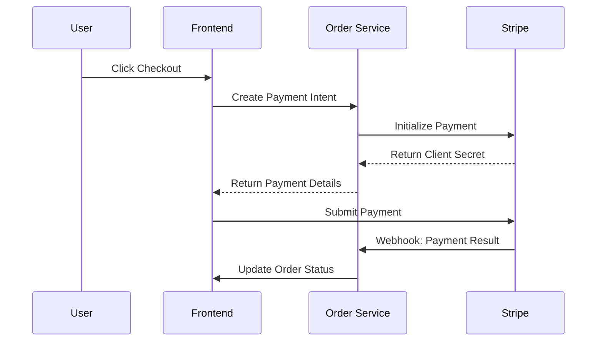

# Payment Integration Guide

This guide explains how the payment system is integrated into ProjectX using Stripe.

## Architecture Overview



## Components

### Payment Library (@projectx/payment)

The payment library provides a clean abstraction over Stripe's functionality:

```typescript
// Main components
- PaymentModule          // NestJS module for payment integration
- StripeService         // Service for Stripe operations
- PaymentConfig         // Configuration interface
```

### Integration Points

1. **Order Service**
   - Handles payment intents creation
   - Processes webhook events
   - Updates order status based on payment events

2. **Frontend Components**
   - Checkout button component
   - Payment form integration
   - Real-time payment status updates

## Payment Flow



## Webhook Events

The system handles the following Stripe webhook events:

1. `payment_intent.succeeded`
   - Payment was successful
   - Order is marked as paid
   - Confirmation email is sent

2. `payment_intent.payment_failed`
   - Payment failed
   - Order is marked as failed
   - User is notified of failure

## Testing Payments

### Test Cards

Use these test card numbers for development:

- Success: 4242 4242 4242 4242
- Requires Authentication: 4000 0025 0000 3155
- Payment Fails: 4000 0000 0000 9995

### Testing Webhooks

1. Using Stripe CLI:
```bash
# Listen for webhooks
stripe listen --forward-to localhost:8082/webhook

# Trigger test events
stripe trigger payment_intent.succeeded
stripe trigger payment_intent.payment_failed
```

2. Using ngrok:
```bash
# Start ngrok tunnel
docker-compose up ngrok-order

# Get the public URL from ngrok UI
open http://localhost:4040
```

## Security Considerations

1. **Environment Variables**
   - `STRIPE_SECRET_KEY`: Never expose in client-side code
   - `STRIPE_WEBHOOK_SECRET`: Used to verify webhook signatures

2. **Webhook Verification**
   - All webhooks are verified using Stripe signatures
   - Invalid signatures are rejected

3. **Error Handling**
   - Payment errors are logged and monitored
   - Users receive appropriate error messages

## Monitoring and Debugging

1. **Logging**
   - Payment attempts are logged
   - Webhook events are logged
   - Error details are captured

2. **Stripe Dashboard**
   - Monitor payments in real-time
   - View webhook delivery attempts
   - Debug payment issues

## Common Issues

1. **Webhook Failures**
   - Check webhook secret is correct
   - Verify ngrok/Stripe CLI is running
   - Check Order service logs

2. **Payment Failures**
   - Verify test card numbers
   - Check Stripe dashboard for error details
   - Verify client secret handling

## Resources

- [Stripe API Documentation](https://stripe.com/docs/api)
- [Stripe Testing Guide](https://stripe.com/docs/testing)
- [Webhook Integration Guide](https://stripe.com/docs/webhooks)
- [Stripe CLI Documentation](https://stripe.com/docs/stripe-cli) 