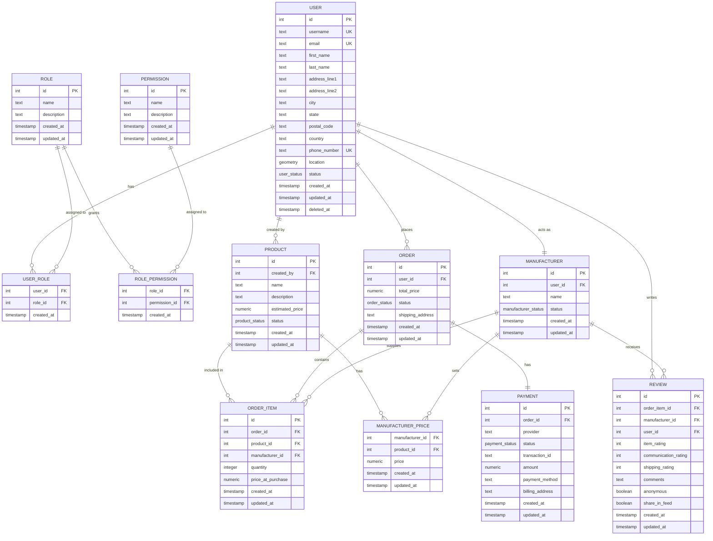

# ProjectX DB Library

This library was generated with [Nx](https://nx.dev).

```mermaid
erDiagram
    USER {
        int id PK
        text username UK
        text email UK
        text first_name
        text last_name
        text address_line1
        text address_line2
        text city
        text state
        text postal_code
        text country
        text phone_number UK
        geometry location
        user_status status
        timestamp created_at
        timestamp updated_at
        timestamp deleted_at
    }

    ROLE {
        int id PK
        text name
        text description
        timestamp created_at
        timestamp updated_at
    }
    
    USER_ROLE {
        int user_id FK
        int role_id FK
        timestamp created_at
    }
    
    PERMISSION {
        int id PK
        text name
        text description
        timestamp created_at
        timestamp updated_at
    }
    
    ROLE_PERMISSION {
        int role_id FK
        int permission_id FK
        timestamp created_at
    }
    
    PRODUCT {
        int id PK
        int created_by FK
        text name
        text description
        numeric estimated_price
        product_status status
        timestamp created_at
        timestamp updated_at
    }

    MANUFACTURER {
        int id PK
        int user_id FK
        text name
        manufacturer_status status
        timestamp created_at
        timestamp updated_at
    }

    MANUFACTURER_PRICE {
        int manufacturer_id FK
        int product_id FK
        numeric price
        timestamp created_at
        timestamp updated_at
    }
    
    ORDER {
        int id PK
        int user_id FK
        numeric total_price
        order_status status
        text shipping_address
        timestamp created_at
        timestamp updated_at
    }
    
    ORDER_ITEM {
        int id PK
        int order_id FK
        int product_id FK
        int manufacturer_id FK
        integer quantity
        numeric price_at_purchase
        timestamp created_at
        timestamp updated_at
    }
    
    PAYMENT {
        int id PK
        int order_id FK
        text provider
        payment_status status
        text transaction_id
        numeric amount
        text payment_method
        text billing_address
        timestamp created_at
        timestamp updated_at
    }

    REVIEW {
        int id PK
        int order_item_id FK
        int manufacturer_id FK
        int user_id FK
        int item_rating
        int communication_rating
        int shipping_rating
        text comments
        boolean anonymous
        boolean share_in_feed
        timestamp created_at
        timestamp updated_at
    }

    USER ||--o{ PRODUCT : "created by"
    USER ||--o{ ORDER : "places"
    USER ||--o{ USER_ROLE : "has"
    USER ||--|| MANUFACTURER : "acts as"
    USER ||--o{ REVIEW : "writes"
    PRODUCT ||--o{ ORDER_ITEM : "included in"
    PRODUCT ||--o{ MANUFACTURER_PRICE : "has"
    ORDER ||--o{ ORDER_ITEM : "contains"
    ORDER ||--|| PAYMENT : "has"
    ROLE ||--o{ USER_ROLE : "assigned to"
    ROLE ||--o{ ROLE_PERMISSION : "grants"
    PERMISSION ||--o{ ROLE_PERMISSION : "assigned to"
    MANUFACTURER ||--o{ ORDER_ITEM : "supplies"
    MANUFACTURER ||--o{ REVIEW : "receives"
    MANUFACTURER ||--o{ MANUFACTURER_PRICE : "sets"
```

## Running unit tests

Run `nx test db` to execute the unit tests via [Jest](https://jestjs.io).
